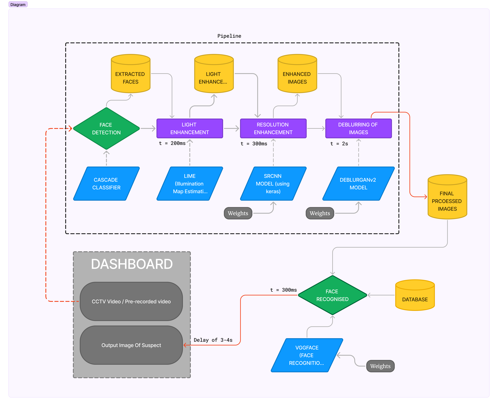
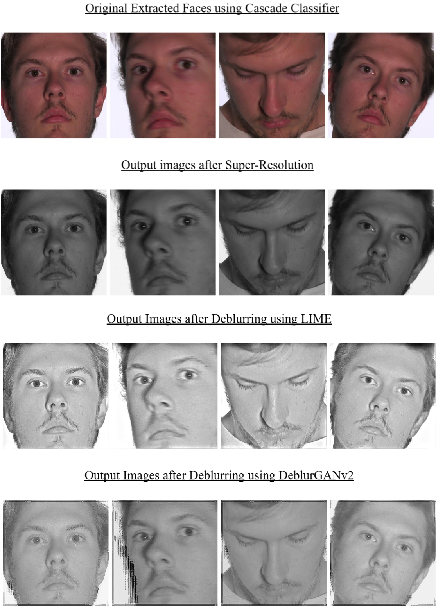
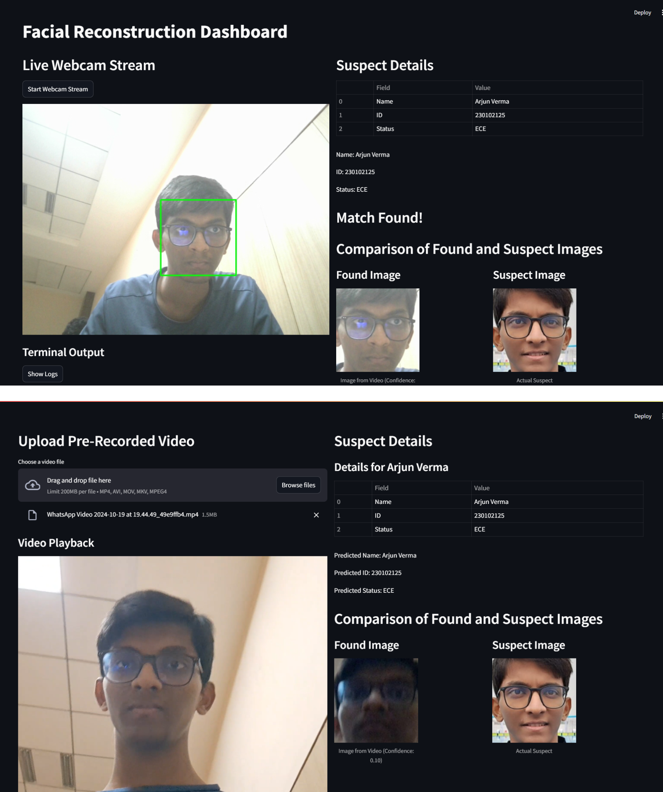

# Abstract

In this paper, we propose a facial image enhancement pipeline
specifically tailored for low-quality CCTV footage, which is frequently
affected by issues such as poor lighting, low resolution, and motion
blur. The proposed pipeline integrates four core components: face
extraction using OpenCV Haar Cascade Classifier, image enhancement
through Super-Resolution Convolutional Neural Networks (SRCNN), handling
poor lighting conditions with the help of LIME( Low-light Image
Enhancement via Illumination Map Estimation)and deblurring via the
DeblurGANv2 model. The objective is to improve the visual quality and
clarity of facial images captured in challenging conditions, enhancing
their usability for identification purposes. Comparative results show
significant improvements in image clarity, enabling more accurate and
efficient facial recognition from previously unusable footage. The
system demonstrates its potential to be applied in real-world problems
faced in security and surveillance.

[Github link to the
MVP](https://github.com/who-else-but-arjun/Ethos_Round2).
[Drive link to the
Weights](https://drive.google.com/drive/folders/1jJ3jcYPZE-fgxxHvT9lR5Q-vjiOeb0PT?usp=sharing).

# Introduction

Footage captured by CCTV often lacks the necessary quality for accurate
facial recognition due to a combination of factors like low resolution,
motion blur, and poor lighting conditions. These issues make it
difficult to extract meaningful data for identification, leading to gaps
in surveillance and law enforcement. The challenge is to develop a
system that can automatically detect, enhance, and deblur faces from
such low-quality footage in a computationally efficient manner. The
objective of this project is to create an end-to-end pipeline capable of
enhancing facial images extracted from CCTV footage. The pipeline
leverages a combination of deep learning and traditional image
processing techniques to address the challenges posed by poor lighting,
motion blur, and low resolution. Specifically, this system will:

-   Detect and extract faces from CCTV footage using OpenCV Haar Cascade
    Classifier.

-   Enhance the resolution and quality of the extracted images using a
    pre-trained SRCNN.

-   Improve the illumination conditions of the the image frames
    extracted from video recordings using LIME.

-   Restore clarity to motion-blurred images using DeblurGANv2.

# Methodology

## Face Detection using OpenCV Haar Cascade Classifier

The first step in the pipeline is to detect faces in the CCTV footage.
For this, we utilized the Haar Cascade Classifier from OpenCV. The
classifier identifies human faces by scanning the image at multiple
scales and detecting features that resemble facial characteristics.
While efficient and fast, the method is sensitive to extreme lighting
variations and occlusions.

-   **Pre-trained Weights:** The Haar Cascade model is pre-trained using
    a large set of positive and negative images, which allows it to
    generalize across diverse face structures and detect faces
    efficiently. The pre-trained XML file for the Haar Cascade model is
    provided in OpenCV's official GitHub repository, making it readily
    accessible for integration. [OpenCV Haar Cascade Pre-trained
    Weights](https://github.com/opencv/opencv/tree/master/data/haarcascades)

-   **Why Chosen:** This model was chosen for its speed and efficiency
    in real-time video processing, which is crucial for the high volume
    of data captured by CCTV systems.

## Image Enhancement using SRCNN (Super-Resolution Convolutional Neural Network)

After detecting faces, we applied the SRCNN model to enhance the
resolution of the extracted facial images. SRCNN is a deep
learning-based approach that upscales low-resolution images and restores
high-frequency details. The network consists of multiple convolutional
layers that learn the mapping from low-resolution to high-resolution
images, ensuring critical facial features are restored.

-   **Pre-trained Weights:** The SRCNN model was employed with
    pre-trained weights available from the official paper
    repository.[SRCNN Pre-trained
    Weights](https://github.com/tegg89/SRCNN-Tensorflow) These weights
    were trained on large datasets of low and high-resolution image
    pairs, allowing the model to perform super-resolution on a wide
    variety of images.

-   **Why Chosen:** SRCNN was selected for its balance between
    effectiveness and computational efficiency. Although more advanced
    models such as SRGAN or EDSR could provide even better results,
    SRCNN offered a faster and more straightforward approach, making it
    well-suited for the scale of this project.

## Improving poor lighting conditions using LIME.

The LIME algorithm models an image as the product of its reflectance (R)
and illumination (T), expressed mathematically as
$I(x) = R(x) \times T(x)$. To estimate the illumination map $T(x)$, the
algorithm identifies the brightest channel by taking the maximum pixel
values across the RGB channels, under the assumption that the brightest
channel contains the most relevant illumination information.

To ensure smooth transitions between illumination values, a weighting
matrix $W$ is constructed based on the first-order derivatives in both
vertical and horizontal directions. This strategy helps maintain
consistency across adjacent pixels. LIME further refines the
illumination map through iterative optimization. The process involves
solving multiple subproblems: illumination estimation using Fourier
transforms ($T$ subproblem), reflectance estimation through gradient
descent ($G$ subproblem), and auxiliary updates involving parameters $Z$
and $u$.

The enhanced brightness is achieved by applying gamma correction to the
illumination map, which compresses the dynamic range for more balanced
lighting. The final enhanced image is produced by dividing the original
image by the illumination map, followed by clamping pixel values to
maintain valid intensity levels. This process effectively mitigates
low-light conditions, resulting in an image with uniform brightness and
improved visibility.

-   **Why Chosen:** LIME is a simple and efficient method for image
    enhancement, operating directly in the spatial domain without the
    need for large datasets or complex computations. It preserves
    natural lighting, introduces fewer artifacts, and is more resilient
    to noise than traditional methods like histogram equalization, which
    often amplify noise and produce unnatural results. Compared to
    Retinex-based models, LIME offers a faster, simpler solution for
    estimating illumination. Unlike deep learning models such as SRCNN
    or GANs, which require extensive training and computational power,
    LIME is lightweight and can be applied universally without training,
    making it ideal for practical use in low-light conditions.

## Deblurring with DeblurGANv2

Many facial images extracted from CCTV footage suffer from motion blur
due to subject movement. To address this, we employed DeblurGANv2, a
state-of-the-art deblurring model based on generative adversarial
networks (GANs). The model consists of a generator(a convolutional
neural network) that learns to restore blurred images and a
discriminator that assesses the quality of the deblurred
images.[DeblurGANv2 Pre-trained
Weights](https://github.com/KupynOrest/DeblurGANv2)

-   The architecture is based on a U-Net-like structure with residual
    blocks. It uses InstanceNormalization layers instead of the more
    traditional BatchNormalization to avoid batch size sensitivity and
    to enhance performance on images. The architecture consists of:

    -   **Reflection Padding 2D:** Initial reflection padding,
        convolution, and activation to preserve edge information which
        is essential for image processing tasks.

    -   **Downsampling layers:** Progressively reduces the image size
        while increasing the feature depth.

    -   **Residual blocks:** These allow the model to better capture
        fine details and maintain information across multiple scales.

    -   **Upsampling layers:**These restore the image back to the
        original size after the downsampling.

    -   **Final convolution and tanh activation:** Produces the output
        image with pixel values between \[-1, 1\].

-   **Pre-trained Weights:** DeblurGANv2 is used with pre-trained
    weights available in the official implementation repository. These
    weights were trained on extensive datasets of blurred and sharp
    image pairs, making it highly effective in handling various types of
    motion blur.

-   **Image Pre-processing:** Before feeding an image into the
    generator,The pixel values are normalized from the range \[0, 255\]
    to \[-1, 1\], which is the input range required by the generator
    (due to the tanh output activation).

-   **Image Post-processing:** After the generator outputs the deblurred
    image, The pixel values are rescaled from the \[-1, 1\] range back
    to \[0, 255\] for displaying or converting the image back to a
    format that can be saved (For eg: PNG or JPEG).

-   **Why Chosen:** DeblurGANv2 was chosen due to its ability to handle
    complex blurring patterns and its superior performance compared to
    traditional deblurring techniques. It stands out as an advanced
    model for image deblurring due to its GAN-based adversarial
    training, multi-scale feature handling via FPN (Feature Pyramid
    Network for Multi-Scale Blur Handling), high perceptual quality with
    improved loss functions, and robustness to real-world conditions.Its
    ability to restore sharpness in images and handle a wide range of
    blur-scenarios with minimal computational overhead made it an ideal
    choice for this pipeline.

# Discussion

## Challenges and Limitations

-   **Lighting and Occlusion:** While the Haar Cascade Classifier is
    efficient, it falters in cases of occlusion or poor lighting. Future
    iterations could integrate more robust face detection models, such
    as deep learning-based detectors that can handle a broader range of
    scenarios.

-   **Real-time Processing:** Although the current pipeline can process
    individual frames efficiently, real-time processing of continuous
    video streams remains a challenge. Incorporating GPU acceleration
    and optimizing the models for faster inference times will be
    essential for real-time deployment.

-   **Fixed Image Size:** The pre-trained model used for deblurring
    assumes all input images are resized to 256x256 pixels during
    preprocessing.This size constraint may degrade the quality of the
    output, especially if the original images have a higher resolution.

## Future Enhancement Implementation: Face Recognition for Security and Surveillance Systems 

The project's future enhancement focuses on creating a real-time face
recognition system for automating attendance tracking. The system
utilizes the VGGFace model, based on VGG16 for feature extraction, while
the classification layer is custom-trained on a dataset of suspect
faces. The enhancement includes an image processing pipeline to ensure
high-quality face detection and recognition during live tracking.

## Concept of Transfer Learning

The system leverages transfer learning, a machine learning technique
where a model developed for a task is reused as the starting point for a
different but related task. In this implementation:

-   VGG16 was pretrained on large-scale face recognition data as part of
    VGGFace. It has already learned general features of human faces,
    such as edges, shapes, and facial structures.

-   Instead of training a model from scratch, the pretrained VGG16
    feature extraction layers were retained, allowing the system to
    reuse the knowledge gained from extensive training on facial
    features

-   A custom classification layer was then added on top of these feature
    extraction layers, which was trained specifically to recognize the
    faces of suspects in our dataset.

## System Architecture

-   **Dataset Structure:** The dataset was organized such that each
    suspect has a dedicated folder containing at least ten face images:
    Dataset/Class_name/images

-   **Suspect Database:** A JSON file was maintained alongside the
    dataset, containing each suspect's unique details (name, id,
    status), which are used for suspect identification during
    recognition.

-   **Model Training:**

    -   The VGG16 feature extraction layers were frozen to retain the
        pretrained weights, and only the custom classification layer was
        trained to map the extracted features to suspect classes.

    -   The training process involved resizing images to 224x224 pixels
        and using callbacks to monitor training performance until the
        model achieved the desired accuracy.

    -   After training, the model's weights were saved for future use in
        real-time face recognition.

##  Real-Time Face Recognition System

The live face recognition system works as follows:

-   **Loading the Model:** The trained VGGFace model, along with the
    custom classification layer, is loaded from the saved weights.

-   **Live Video Stream:** A live camera feed captures real-time footage
    of suspects.

-   **Face Detection:** The OpenCV Haar Cascade Classifier is employed
    to detect faces in each frame of the video stream.

-   **Image Enhancement Pipeline:** The OpenCV Haar Cascade Classifier
    is employed to detect faces in each frame of the video stream.

    -   **SRCNN:** Enhances the resolution of the detected faces,
        improving the clarity of low-resolution images.

    -   **LIME:**Increases the illumination in poor-light image frames.

    -   **DeblurGANv2:** Removes motion blur from images, ensuring the
        detected faces are sharp and suitable for recognition.

-   **Face Recognition:** The enhanced face images are resized to
    224x224 pixels and passed through the VGGFace model, which predicts
    the class ID corresponding to the suspect.

-   **Suspect Identification:** The predicted class ID is
    cross-referenced with the suspect database stored in the JSON file
    to retrieve the suspect's details, such as name, id and status.

## Challenges and Solutions

-   **Image Quality:** The live video feed or the video recording of the
    suspect might include low-quality images due to lighting or motion,
    which are effectively handled by the SRCNN, LIME and DeblurGANv2
    pipelines, ensuring that the images are of sufficient quality for
    recognition.

-   **Real-Time Processing:** The system is optimized for real-time
    performance, ensuring that each video frame is processed quickly
    without significant delays in face detection and recognition.

-   **Multiple Faces:** The system is capable of handling multiple faces
    in real-time, recognizing and flagging alerts for multiple suspects
    recognised in the frame.

# Results

The face recognition system successfully identifies suspects in
real-time. By leveraging transfer learning with the VGGFace model and
image enhancement techniques, the system achieved high accuracy and
efficiency in recognition.

-   **Recognition Accuracy:** The combination of the VGGFace model,
    transfer learning, and image enhancement allowed for accurate
    student identification even in challenging conditions.

-   **Efficient Processing:** The system handled real-time video frames
    smoothly, maintaining high performance in face detection and
    recognition.

## Implementing Dashboard for real-time Monitoring: 

The Streamlit interface acts as an interactive dashboard for users to
engage with the facial reconstruction and recognition pipeline. On the
left hand side of the interface, users can upload pre-recorded videos in
formats such as MP4 or AVI. Upon uploading, the video is displayed with
playback options, and users can also view terminal logs detailing the
processing steps in real time. On the right hand side, suspect details,
such as name, ID, and status, are presented in a structured table format
for easy reference. Once a video is processed, the system analyzes each
frame to detect and classify faces. If a match is found, the interface
displays both the found face from the video and the actual suspect image
side by side for visual comparison, along with the prediction confidence
and class information.The use of Streamlit provides a smooth,
interactive experience without the need for complex back-end systems,
ensuring that even non-technical users can interact with the model
results efficiently. This same interface is also used in live
video-streaming wherein the suspects are identified in a live-video feed
through web-cam.

# References

-   Dong, C., Loy, C. C., He, K., & Tang, X. (2015). *Image
    Super-Resolution Using Deep Convolutional Networks (SRCNN)*. IEEE
    Transactions on Pattern Analysis and Machine Intelligence.

-   Kupyn, O., Martyniuk, T., Wu, J., & Wang, Z. (2019). *DeblurGAN-v2:
    Deblurring (Orders-of-Magnitude) Faster and Better*. Proceedings of
    the IEEE International Conference on Computer Vision (ICCV).

-   [Keras VGGFace GitHub
    Repository](https://github.com/rcmalli/keras-vggface).

-   Guo, X., Li, Y., & Ling, H. (2017). LIME: Low-Light Image
    Enhancement via Illumination Map Estimation. IEEE Transactions on
    Image Processing, 26(2), 982--993. [LIME Implementation GitHub
    Repository](https://github.com/estija/LIME).
